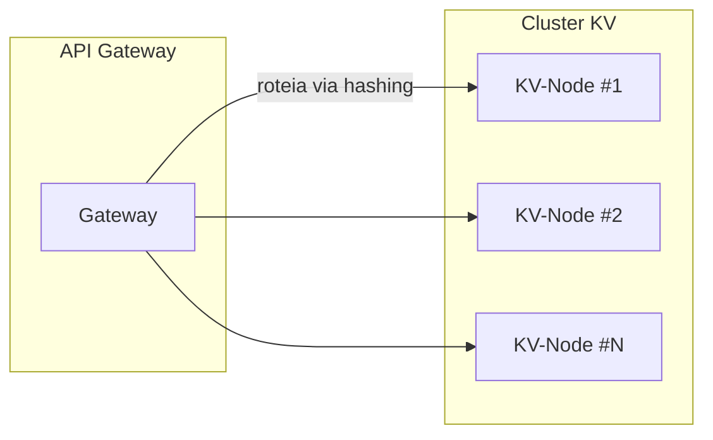

# Diagrama de Arquitetura

```mermaid
graph LR
  subgraph API Gateway
    A[Gateway]
  end
  subgraph Cluster KV
    B1[KV-Node #1]
    B2[KV-Node #2]
    B3[KV-Node #N]
  end
  A -->|roteia via hashing| B1
  A --> B2
  A --> B3
```
